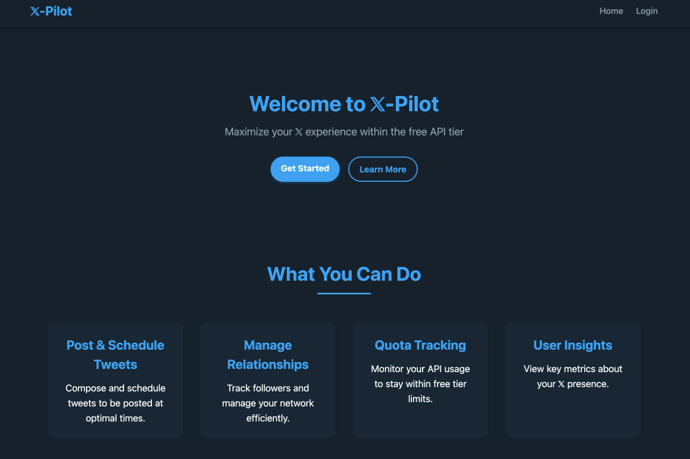

# 𝕏-Pilot

A frontend interface for managing 𝕏 (Twitter) accounts within the limitations of the Free 𝕏 API tier, powered by Tweepy. Fully compatible with X API v2.

## Screenshot



## Features

- Authentication management for 𝕏 API v2
- Post posting, deletion, and scheduling (within free tier limits)
- Support for dynamic character limits based on user verification status
- User relationship management (follow/unfollow, block/mute)
- User information and metrics viewing with verification status
- Post engagement (like, repost, bookmark)
- List management
- Streaming capabilities
- Basic analytics
- Automated actions
- Quota tracking for X API free tier usage

## Getting Started

### Prerequisites

- Python 3.7 or later
- 𝕏 Developer account with API credentials
- Virtual environment (recommended)

### Installation

1. Clone the repository:
   ```bash
   git clone https://github.com/TheSethRose/X-Pilot.git
   cd X-Pilot
   ```

2. Create and activate a virtual environment:
   ```bash
   python -m venv venv
   source venv/bin/activate  # On Windows: venv\Scripts\activate
   ```

3. Install dependencies:
   ```bash
   pip install -r requirements.txt
   ```

4. Create a `.env` file with your 𝕏 API credentials:
   ```
   SECRET_KEY=your_flask_secret_key
   CONSUMER_KEY=your_api_key
   CONSUMER_SECRET=your_api_secret
   ACCESS_TOKEN=your_access_token
   ACCESS_TOKEN_SECRET=your_access_token_secret
   DATABASE_URL=sqlite:///twikit.db
   ```

5. Initialize the database:
   ```bash
   flask db init
   flask db migrate -m "Initial migration"
   flask db upgrade
   ```

6. Start the application:
   ```bash
   flask run
   ```

## Project Structure

```
X-Pilot/
├── app/                  # Application code
│   ├── __init__.py       # Application factory
│   ├── models.py         # Database models
│   └── routes/           # Route blueprints
├── static/               # Static assets
│   ├── css/              # CSS files
│   └── js/               # JavaScript files
├── templates/            # HTML templates
│   ├── auth/             # Authentication templates
│   ├── errors/           # Error page templates
│   └── posts/           # Post management templates
├── utils/                # Utility scripts
├── .env                  # Environment variables (create this)
├── README.md             # Project documentation
├── todo.md               # Project roadmap and milestone tracking
└── requirements.txt      # Project dependencies
```

## Development Status

This project is under active development. Check [todo.md](todo.md) for current progress and upcoming features.

## License

[MIT](LICENSE)

## Contributing

Contributions are welcome! Please feel free to submit a Pull Request.

## Author

Created by [Seth Rose](https://twitter.com/TheSethRose). Visit [SethRose.dev](https://SethRose.dev) for more projects.

## Acknowledgements

- [Tweepy](https://www.tweepy.org/) - 𝕏 API library for Python
- [Flask](https://flask.palletsprojects.com/) - Web framework
